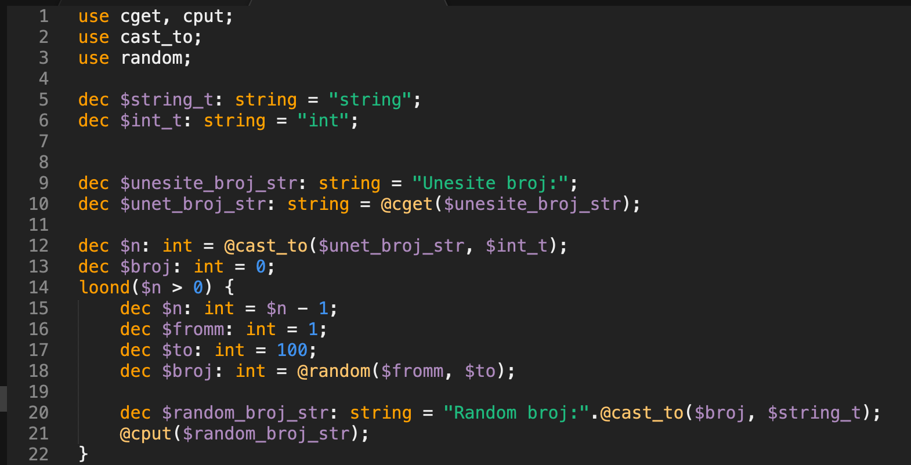

# Lanta - a simple programming language with its compiler, grammar and language plugin for SublimeText

Lanta is my simple programming language described in file grammar.txt

Lanta compiler is written in python and transpile lanta code to raw python code.

Compile lanta by command:

```bash
python lanta.py input.lnt > output.py
```

Sublime theme example:


